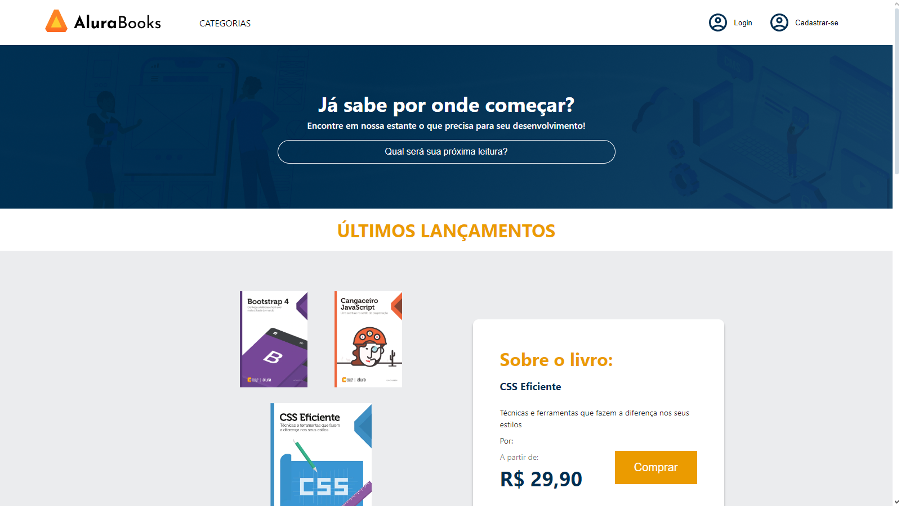
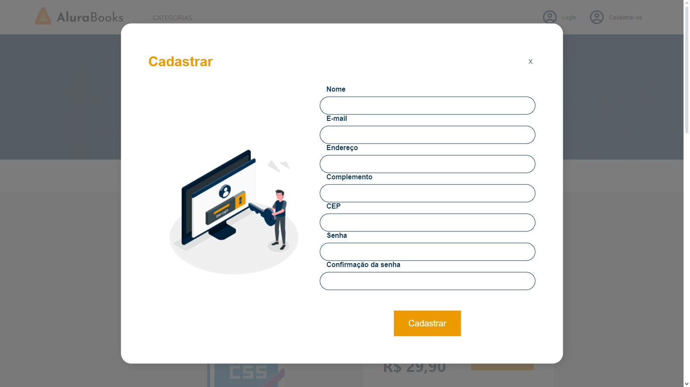
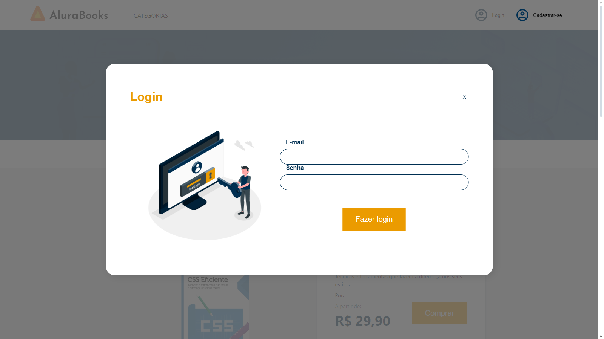
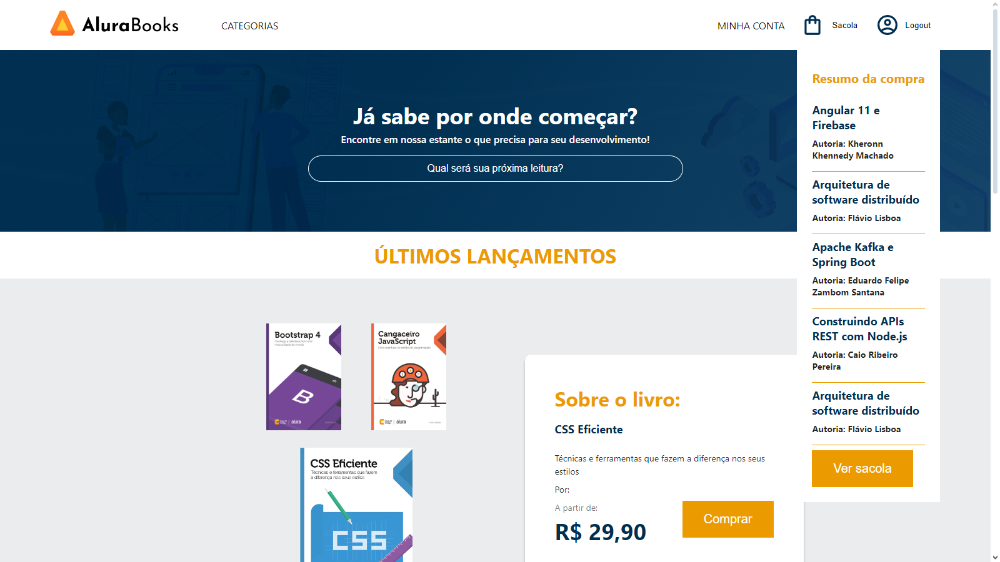
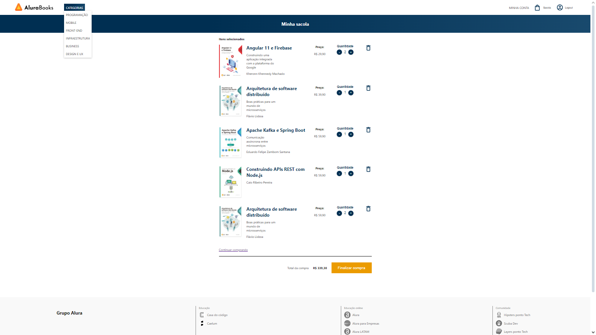
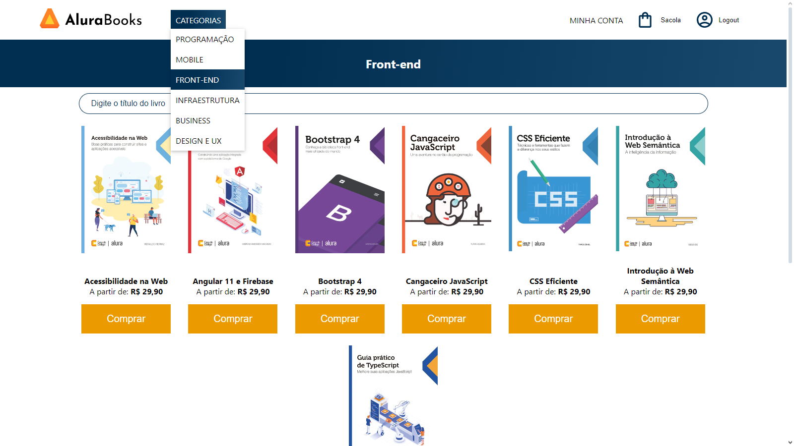

## Descrição:
Projeto que utiliza como base um servidor GraphQL para uma página fictícia de compra de livros  
Utiliza-se do React Apollo Client para a consulta e mutações de dados para o servidor do projeto  
Manipula-se tokens JWT gerados do servidor para a autenticação e cadastro de usuários por meio da manipulação da sessionStorage  
Permite aumentar e diminuir quantidade dos livros, incluí-los no Carrinho, e remover quando pressionado o botão excluir ou quando quantidade é zero  

## Principais Ferramentas:
* Typescript
* Axios
* React
* React Router
* React Query
* Context API
* Consultas GraphQL com React Apollo Client

## Visualização:

 
 

 
 

 
 

 
 

 
 

 
 

